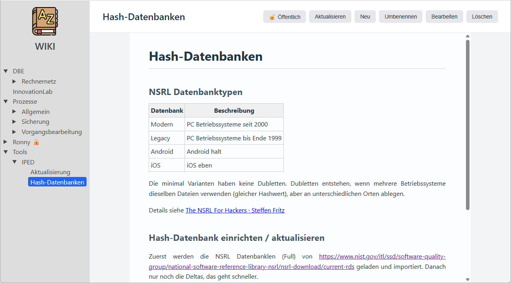
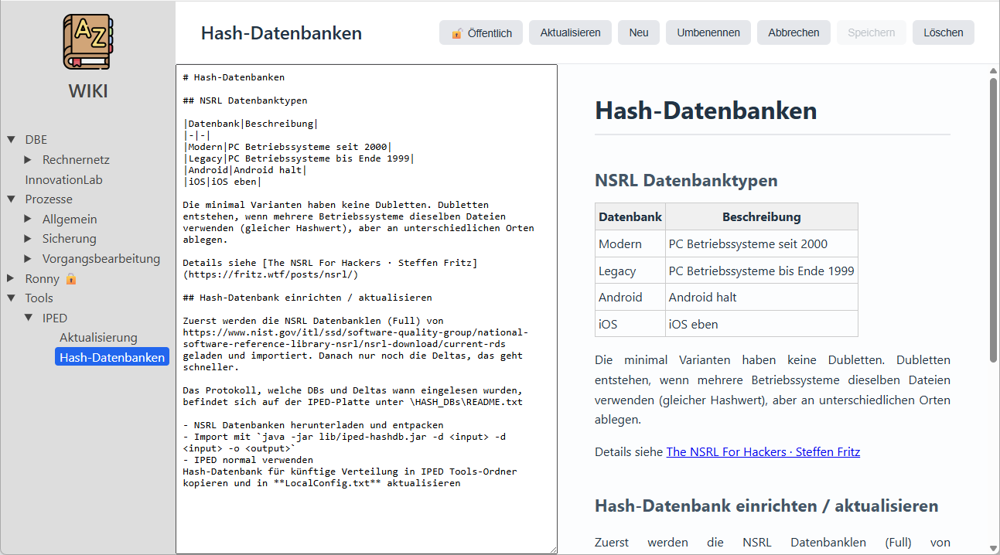

# Wiki

Dieses Wiki basiert auf https://github.com/hilderonny/arrange und speichert seine Inhalte als [Markdown](https://de.wikipedia.org/wiki/Markdown) in einer SQLite Datenbank ab.

### Vorschau



### Editor



# Installation unter Linux als Hintergrunddienst

```sh
# NodeJS installieren
curl -o- https://raw.githubusercontent.com/nvm-sh/nvm/v0.40.4/install.sh | bash
\. "$HOME/.nvm/nvm.sh"
nvm install 24

# Repositories klonen
git clone https://github.com/hilderonny/arrange.git
git clone https://github.com/hilderonny/wiki.git

# Abhängigkeiten installieren
cd arrange
npm install

# Hintergrunddienst einrichten und starten
sudo nano /etc/systemd/system/wiki.service
sudo systemctl enable wiki
sudo systemctl start wiki
```

Danach ist das Wiki unter https://SERVER:8443 erreichbar.

## /etc/systemd/system/wiki.service

```
[Unit]
Description=wiki

[Service]
ExecStart=/######PFAD_ZU_NODE###### --experimental-sqlite /######PFAD_ZU_ARRANGE######/server.mjs --port 8443 --datapath /data --crtfile /server.crt --keyfile /server.key --tokensecret hubbelebubbele --htmlpath /=/######PFAD_ZU_WIKI######
WorkingDirectory=/######PFAD_ZU_ARRANGE######
Restart=always
RestartSec=10

[Install]
WantedBy=multi-user.target
```